# 🛡️ S15_Briceno_SeguridadPrivacidadApp – App Móvil con Protección de Datos, Forense y Zero Trust

`S15_Briceno_SeguridadPrivacidadApp` es una aplicación Android desarrollada en Kotlin que implementa un sistema completo de **protección de datos, seguridad forense y compliance**. La app simula una gestión segura de accesos, evidencias digitales y privacidad de usuarios, aplicando principios de arquitectura **Zero Trust**, **protecciones anti-reverse engineering** y **cumplimiento con GDPR/CCPA**.

Este proyecto corresponde a la **Semana 14** del curso de Seguridad y Privacidad Móvil.

---

## 🔐 Características principales

- Gestión de accesos con **tokens temporales Zero Trust**.
- Autenticación biométrica obligatoria para acciones sensibles.
- **Encriptación AES-256-GCM** de datos y logs.
- Registro detallado de eventos con timestamps y tipos de acción.
- **Protección contra debugging, emulación e ingeniería inversa**.
- Auditoría forense con integridad de logs tipo **blockchain local**.
- Exportación de logs firmados digitalmente.
- Generación de reportes de cumplimiento **GDPR / CCPA**.
- Búsqueda de incidentes mediante palabras clave.

---

## 🔎 Módulo Forense (3.4)

| Funcionalidad                             | Descripción                                                                 |
|------------------------------------------|-----------------------------------------------------------------------------|
| 🧾 **Chain of Custody**                  | Cada evento incluye hash y previousHash con SHA-256, garantizando integridad. |
| 🔐 **Logs Tamper-Evident**              | La estructura hash–previousHash impide modificaciones sin detección.       |
| 📑 **Reporte GDPR/CCPA Automático**     | Reporte JSON con lista de acciones por usuario generada en tiempo real.    |
| 🕵️ **Investigación de Incidentes**      | Filtrado de eventos por palabra clave (por ejemplo, “export” o “borrar”).  |

---
# EVALUACIÓN TÉCNICA: ANÁLISIS Y MEJORA DE SEGURIDAD EN APLICACIÓN ANDROID

## Parte 1: ANÁLISIS DE SEGURIDAD BÁSICO

### 1.1 IDENTIFICACIÓN DE VULNERABILIDADES

#### 1.1.1. ¿Qué método de encriptación se utiliza para proteger datos sensibles?
El método de encriptación utilizado es **AES-256-GCM**.
- **AES-256-GCM** es un algoritmo de encriptación simétrica de 256 bits que proporciona tanto confidencialidad (encriptación) como autenticación (integridad de los datos).
- Se utiliza para encriptar datos sensibles en el método `storeSecureData()` mediante **EncryptedSharedPreferences**.

#### 1.1.2. Identifica al menos 2 posibles vulnerabilidades en la implementación actual del logging

**A. Almacenamiento de logs no encriptados:**
- El archivo de logs de acceso (`access_logPrefs`) no se cifra. Este almacenamiento solo utiliza **SharedPreferences** normales para guardar los logs en texto claro.
- **Riesgo**: Si alguien tiene acceso a la memoria del dispositivo (por ejemplo, con acceso root o mediante un ataque físico), podría obtener información sensible de los logs. Esto es especialmente riesgoso si se registran eventos sensibles como el acceso a datos o la limpieza de datos.

**B. No hay control de acceso ni autenticación para el acceso a los logs:**
- El sistema de logs no tiene ningún tipo de control de acceso o autenticación. Cualquier parte de la aplicación puede acceder a los logs a través de `accessLogPrefs`, lo cual representa un punto de fuga de información.
- **Riesgo**: Un atacante con acceso a la app podría manipular o leer estos logs, obteniendo información sobre las acciones del usuario o incluso intentando entender patrones que podrían ayudar en un ataque más sofisticado.

#### 1.1.3. ¿Qué sucede si falla la inicialización del sistema de encriptación?
Si la inicialización del sistema de encriptación falla (por ejemplo, si no se puede crear la clave maestra o la encriptación no está disponible por alguna razón), el flujo entra en el bloque **catch** y se usa una implementación de respaldo.

### 1.2 PERMISOS Y MANIFIESTO

#### 1.2.1. Lista todos los permisos peligrosos declarados en el manifiesto

| Permiso                                    | Grupo            | Descripción                                                          |
|--------------------------------------------|------------------|----------------------------------------------------------------------|
| `android.permission.CAMERA`               | Cámara           | Acceso a la cámara.                                                  |
| `android.permission.READ_EXTERNAL_STORAGE` | Almacenamiento   | Acceso al almacenamiento externo (obsoleto desde API 33+).           |
| `android.permission.READ_MEDIA_IMAGES`    | Imágenes (API 33+)| Leer imágenes del almacenamiento a partir de Android 13.             |
| `android.permission.RECORD_AUDIO`         | Micrófono        | Grabar audio.                                                        |
| `android.permission.READ_CONTACTS`        | Contactos        | Leer contactos del usuario.                                           |
| `android.permission.CALL_PHONE`           | Teléfono         | Realizar llamadas telefónicas.                                       |
| `android.permission.SEND_SMS`             | SMS              | Enviar mensajes SMS.                                                 |
| `android.permission.ACCESS_COARSE_LOCATION`| Ubicación       | Obtener ubicación aproximada.                                        |

#### 1.2.2. ¿Qué patrón se utiliza para solicitar permisos en runtime?
Se utiliza el patrón **Activity Result API**, que es la forma recomendada desde AndroidX.

```kotlin
private val requestPermissionLauncher = registerForActivityResult(
    ActivityResultContracts.RequestPermission()
) { isGranted -> 
    // lógica cuando se responde al permiso
}
```

#### 1.2.3. Identifica qué configuración de seguridad previene backups automáticos

```xml
<application
    android:allowBackup="false"
    android:backupAgent="null"
</application>
```
Esto hace que se desactive el sistema de backup automático de Android, que de lo contrario guardaría datos de la app en la cuenta de Google del usuario.
Esto evita posibles fugas de datos sensibles si el usuario cambia de dispositivo o rootea el sistema.

### 1.3 GESTIÓN DE ARCHIVOS

#### 1.3.1. ¿Cómo se implementa la compartición segura de archivos de imágenes?
La compartición segura se logra utilizando el **FileProvider** para generar un URI de contenido que apunta a la imagen almacenada en el directorio privado de la app, lo cual protege el acceso directo al sistema de archivos del dispositivo.

#### 1.3.2 ¿Qué autoridad se utiliza para el FileProvider?
La autoridad que se utiliza para el **FileProvider** es un nombre único que debe ser declarado en el manifiesto. En este caso, se ha usado `"com.example.app.fileprovider"`, que debe coincidir con la autoridad declarada en el archivo `AndroidManifest.xml` y utilizada en `FileProvider.getUriForFile()`.

#### 1.3.3. Explica por qué no se debe usar file:// URIs directamente
El uso de **file:// URIs** directamente está desaconsejado debido a que este tipo de URI expone rutas completas del sistema de archivos local, lo cual podría poner en riesgo la privacidad del usuario y abrir posibles brechas de seguridad.

**Problemas de seguridad:**
- **Seguridad**: Acceder a archivos con **file://** expone directamente los archivos a otras aplicaciones sin restricciones, lo que puede permitir acceso no autorizado a datos sensibles.
- **Compatibilidad**: Desde Android 7.0 (API 24), el uso de **file://** se ha restringido debido a problemas de seguridad. Esto puede hacer que el acceso a archivos falle en dispositivos con versiones recientes de Android.
- **Restricciones de permisos**: Android requiere el uso de **ContentProvider** para gestionar el acceso a archivos, asegurando que solo las aplicaciones con permisos adecuados puedan acceder a los datos.

---

# 📸 Capturas de pantalla

## Parte 2: Implementación y Mejoras Intermedias

### 2.1 **Fortalecimiento de la Encriptación**

| 🟢 **Fortalecimiento de la Encriptación 1** | 🟢 **Fortalecimiento de la Encriptación 2** |
|------------------|---------------------------|
| 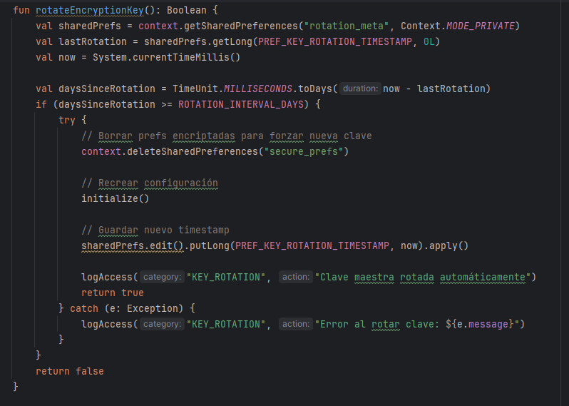 | 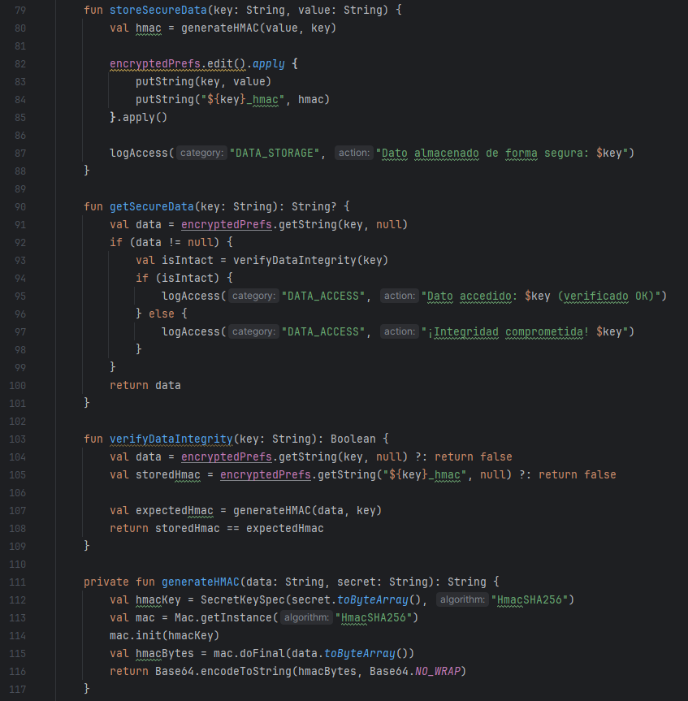 |

### 2.2 **Sistema de Auditoría Avanzado**

| 🔒 **Sistema de Auditoría Avanzado 1** | 🔒 **Sistema de Auditoría Avanzado 2** |
|------------------|---------------------------|
|  | 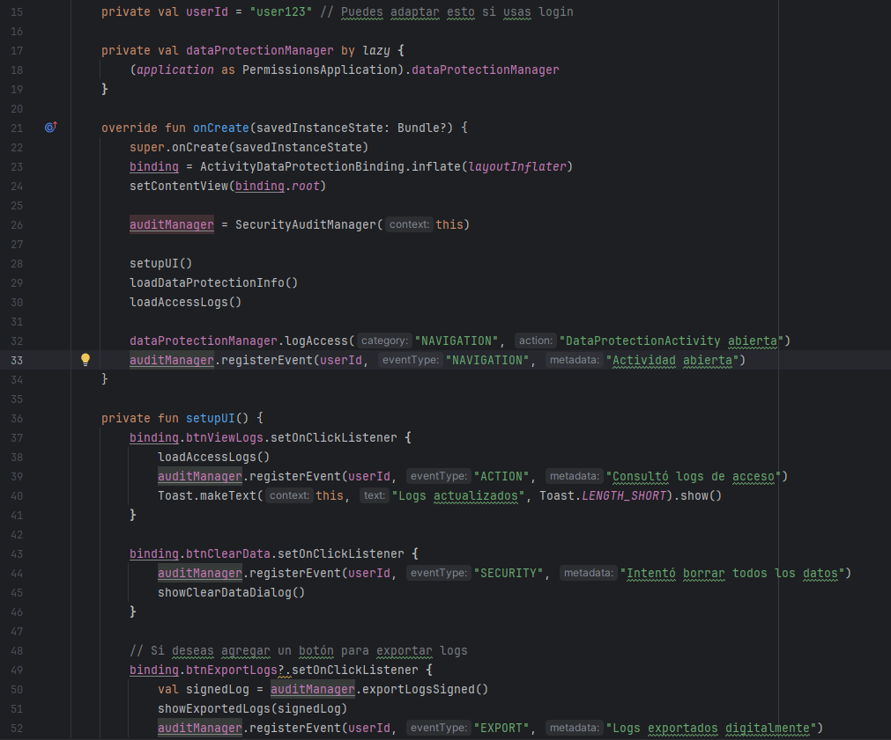 |

### 2.3 **Biometría y Autenticación**

| 🧾 **Biometría y Autenticación 1** | 🧾 **Biometría y Autenticación 2** |
|-------------------------|---------------------------|
| 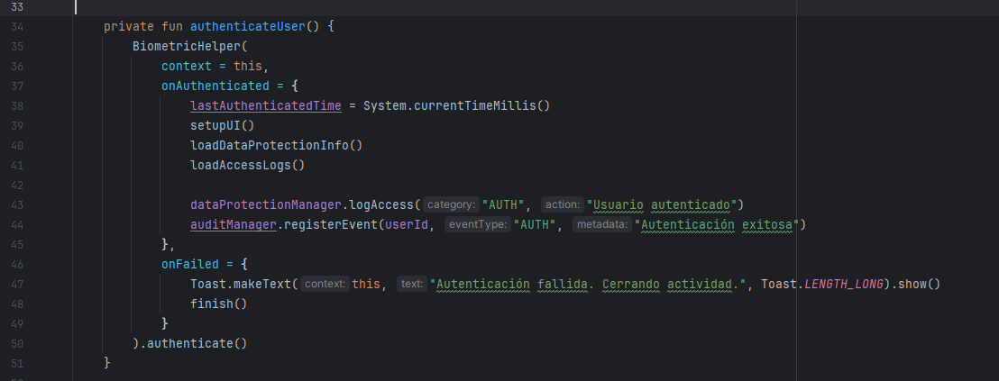 | 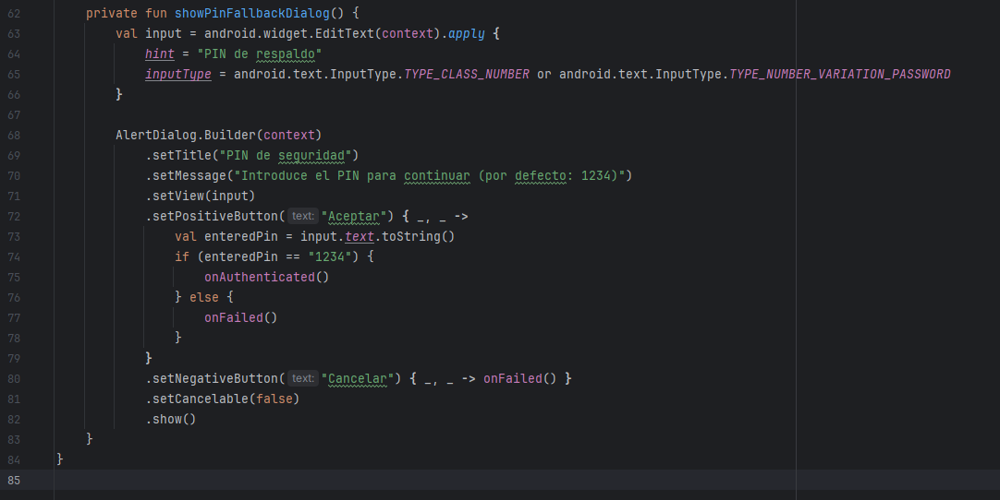 |

---

## Parte 3: Arquitectura de Seguridad Avanzada

### 3.1 **Implementación de Zero-Trust Architecture**

| 🕵️ **Zero-Trust Architecture 1** | 🕵️ **Zero-Trust Architecture 2** |
|---------------------|--------------------|
| 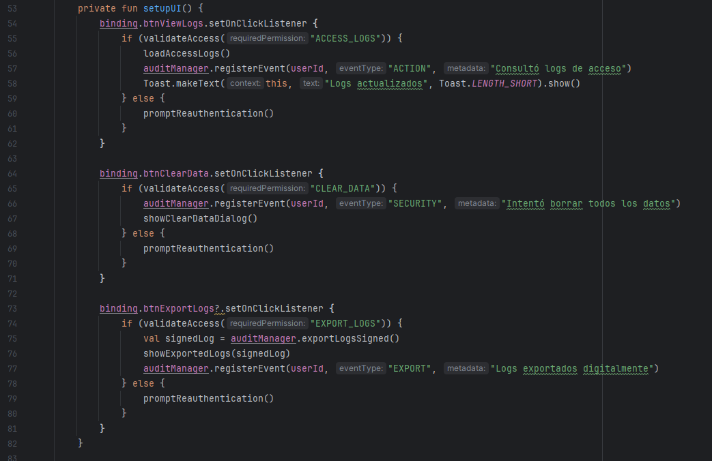 | 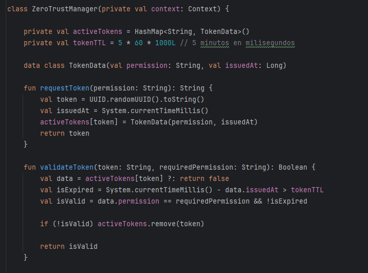 |

### 3.2 **Protección Contra Ingeniería Inversa**

| 🛡️ **Protección Contra Ingeniería Inversa 1** | 🛡️ **Protección Contra Ingeniería Inversa 2** |
|--------------------------|-------------------------|
| 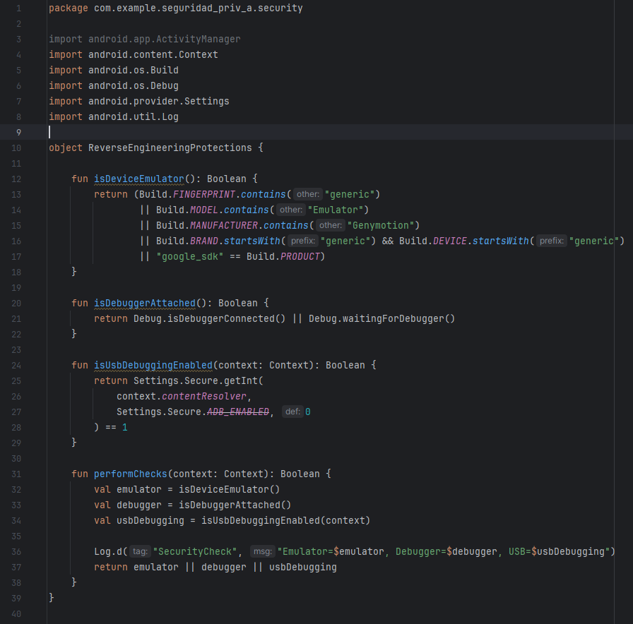 | 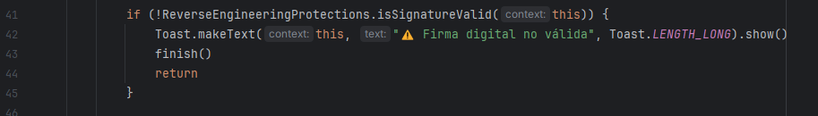 |

### 3.3 **Framework de Anonimización Avanzado**

| 🔒 **Anonimización Avanzada 1** | 🔒 **Anonimización Avanzada 2** |
|--------------------------|-------------------------|
| 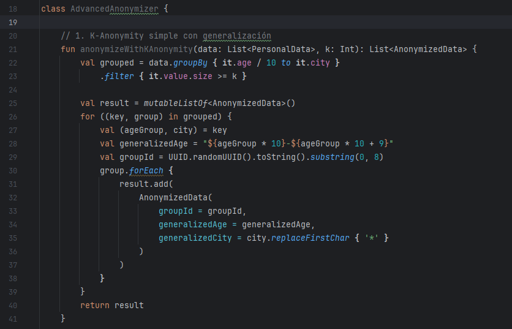 |  |

### 3.4 **Análisis Forense y Compliance**

| 📜 **Análisis Forense 1** | 📜 **Análisis Forense 2** |
|-------------------------|-------------------------|
| 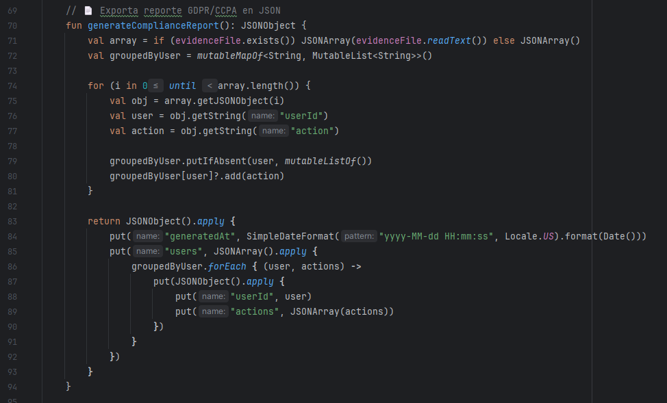 | 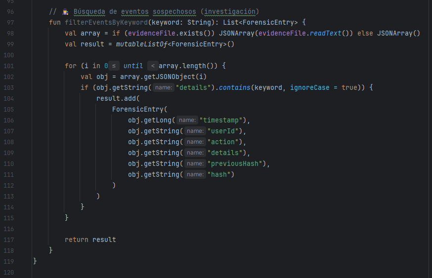 |

---


## 🛠️ Tecnologías utilizadas

- **Kotlin**
- Android Studio
- `BiometricPrompt` API
- `EncryptedSharedPreferences`
- SHA-256, JSON y almacenamiento local
- Detección de firma, debugging y emulador
- Diseño modular de clases

---

## 📁 Estructura del proyecto

- `DataProtectionActivity.kt`: Pantalla principal. Muestra info de seguridad, logs y botones de acción.
- `SecurityAuditManager.kt`: Módulo de auditoría de eventos seguros.
- `ZeroTrustManager.kt`: Lógica de tokens por permiso y validación granular.
- `BiometricHelper.kt`: Wrapper para autenticación biométrica.
- `ReverseEngineeringProtections.kt`: Controles anti-debugging, emulador y firma APK.
- `ForensicLogger.kt`: Registro de eventos forenses, generación de reportes, búsqueda de incidentes.
- `activity_data_protection.xml`: Diseño de interfaz con botones de logs, borrar datos, exportar e investigar.
- `strings.xml`: Traducciones centralizadas de botones y mensajes.

---

## 🧪 Ejemplos de eventos registrados

```json
[
  {
    "timestamp": 1722954805123,
    "userId": "user123",
    "action": "EXPORT",
    "details": "Logs exportados digitalmente",
    "previousHash": "o8O0vZKmfN...",
    "hash": "u92djSk9s8h..."
  },
  {
    "timestamp": 1722954220999,
    "userId": "user123",
    "action": "SECURITY",
    "details": "Intentó borrar todos los datos",
    "previousHash": "GENESIS",
    "hash": "k2FbdfL2os4..."
  }
]
```
---

## ⚙️ Requisitos técnicos
- Android Studio **Hedgehog** o superior
- **Target SDK** 33+
- **Min SDK** 24+
- **Kotlin** y **ViewBinding** habilitados
- Permisos biométricos en el **AndroidManifest.xml**

## 🔐 Consideraciones de privacidad y compliance
- No se almacenan datos personales reales.
- Los datos están **anonimizados** o **simulados**.
- Se implementa el principio de **privacy-by-design**.
